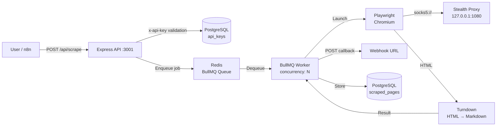

<p align="center">
  <h1 align="center">WebScrape AI Platform</h1>
  <p align="center"><strong>The Open-Source Alternative to Firecrawl, Octoparse & Gumloop</strong></p>
  <p align="center">
    <a href="#"></a>
    <a href="#"></a>
    <a href="#"></a>
    <a href="#"></a>
    <a href="#"></a>
    <a href="#"></a>
    <a href="#"></a>
  </p>
</p>

---

A self-hosted, multi-tenant AI web scraping and orchestration platform that replaces **Firecrawl**, **Octoparse**, and **Gumloop** — without the per-page pricing. Built with **n8n**, **Crawlee/Playwright**, **Turndown**, **BullMQ** (Redis), and **PostgreSQL** (pgvector).

## Features

| Capability | Details |
|---|---|
| **🤖 Playwright Stealth Crawling** | Anti-bot fingerprinting, JS rendering, `networkidle` waits, automatic retries (×3) |
| **📝 LLM-Ready Markdown** | Raw HTML → clean Markdown via Turndown — feed directly into GPT, Claude, LangChain |
| **⚡ Async Queue Architecture** | BullMQ + Redis prevents Chromium OOM crashes; max N concurrent browsers (configurable) |
| **🔑 Multi-Tenant API** | Per-user API keys, data isolation (`user_id` on every row), per-user rate limits (10 req/min) |
| **🔗 Webhook Callbacks** | Submit a URL, get a `jobId` back immediately — result arrives at your webhook when ready |
| **🕵️ SOCKS5 Proxy Support** | Route all Playwright traffic through a stealth proxy (Hysteria-compatible) |
| **🧩 n8n Integration** | Importable workflow: trigger scrape → AI extract → PostgreSQL storage |
| **🐳 One-Command Deploy** | `docker compose up -d` — n8n + PostgreSQL + Redis + Crawlee API |
| **📊 Bull Board Dashboard** | Live queue monitoring at `/admin/queues` (behind API key auth) |
| **🔄 Webhook Resilience** | Exponential backoff retry (×3) + Dead Letter Queue logging |

## Architecture



**Data flow:**
1. Client sends a URL (+ API key) → Express queues the job in Redis
2. BullMQ worker (max N concurrent) picks up the job
3. Playwright launches headless Chromium, waits for JS render, extracts HTML
4. Turndown converts HTML to clean Markdown
5. Result is POSTed to your webhook (if provided) and stored in PostgreSQL

## Quick Start

### Prerequisites

- [Docker](https://docs.docker.com/get-docker/) & [Docker Compose v2](https://docs.docker.com/compose/install/)
- Git

### 1. Clone

```bash
git clone https://github.com/TriggerMinds/webscrape-ai-platform.git
cd webscrape-ai-platform
```

### 2. Configure environment

Create a `.env` file in the project root:

```bash
cat > .env << 'EOF'
# PostgreSQL
DB_USER=n8n
DB_PASSWORD=n8n_password
DB_NAME=n8n

# n8n
N8N_ENCRYPTION_KEY=change-me-to-a-random-32-char-string
N8N_WEBHOOK_URL=http://localhost:5678/

# Crawlee API
CRAWLEE_PORT=3001
PROXY_URL=socks5://127.0.0.1:1080

# Redis & Queue
REDIS_HOST=redis
REDIS_PORT=6379
MAX_CONCURRENCY=3
EOF
```

### 3. Start the stack

```bash
docker compose up -d --build
```

This launches four services:

| Service | Port | Purpose |
|---|---|---|
| **n8n** | `5678` | Workflow orchestrator with AI/LangChain nodes |
| **Crawlee API** | `3001` | Scraping microservice (Express + BullMQ worker) |
| **Redis** | `6379` | Job queue broker |
| **PostgreSQL** | `5432` | Database with pgvector |

### 4. Create your first API key

```bash
docker compose exec postgres psql -U n8n -d n8n -c "
INSERT INTO api_keys (key_value, user_id, name)
VALUES ('wsp_' || substr(md5(random()::text), 1, 16), 'user_demo', 'Demo User');
"
```

Copy the key from the output — you'll need it for every API call.

### 5. Submit a scrape job

```bash
curl -X POST http://localhost:3001/api/scrape \
  -H "Content-Type: application/json" \
  -H "x-api-key: <your-api-key>" \
  -d '{"url": "https://example.com"}'
```

You'll receive a `202 Accepted` with a `jobId`:

```json
{
  "jobId": "abc123",
  "status": "queued",
  "userId": "user_demo",
  "message": "Scrape job enqueued for https://example.com"
}
```

### 6. (Optional) Receive results via webhook

Submit with a `webhookUrl` and the result will be POSTed there when ready:

```bash
curl -X POST http://localhost:3001/api/scrape \
  -H "Content-Type: application/json" \
  -H "x-api-key: <your-api-key>" \
  -d '{
    "url": "https://example.com",
    "webhookUrl": "https://my-server.com/callback"
  }'
```

Callback payload (success):

```json
{
  "success": true,
  "userId": "user_demo",
  "url": "https://example.com",
  "title": "Example Domain",
  "rawHtml": "<html>...</html>",
  "markdown": "# Example Domain\n\nThis domain is for use..."
}
```

## n8n Integration

The platform ships with a ready-to-import n8n workflow that demonstrates the full async pipeline.

### Import the workflow

1. Open `http://localhost:5678` in your browser
2. Complete the n8n setup wizard
3. Go to **Workflows** → **Add Workflow** → **Import from File**
4. Select `n8n-workflows/scrape-and-extract.json`
5. Click **Save**, then toggle **Active** to enable

### Workflow structure

```
┌─────────────────────────────────────────────────────────────┐
│ Part 1 — Queue Trigger (/webhook/scrape-start)              │
│                                                             │
│  [Webhook] ──▶ [Queue Scrape Job] ──▶ (HTTP 202 to caller) │
│                   │                                         │
│                   │ POST /api/scrape + x-api-key header     │
│                   ▼                                         │
│              Crawlee API                                     │
└─────────────────────────────────────────────────────────────┘

┌─────────────────────────────────────────────────────────────┐
│ Part 2 — Result Handler (/webhook/scrape-result)            │
│                                                             │
│  [Webhook] ◀── (Crawlee worker POSTs result here)           │
│      │                                                      │
│      ▼                                                      │
│  [AI Extract (Mock)] ──▶ [Store in PostgreSQL]             │
│      │                                                      │
│      │ (Replace with real OpenAI/LangChain node)            │
└─────────────────────────────────────────────────────────────┘
```

### Trigger the workflow

```bash
curl -X POST http://localhost:5678/webhook/scrape-start \
  -H "Content-Type: application/json" \
  -d '{
    "url": "https://example.com",
    "apiKey": "<your-api-key>"
  }'
```

The workflow passes your API key in the `x-api-key` header when calling the Crawlee API. Results flow back through the second webhook, get processed by the AI node, and land in PostgreSQL — all scoped to your `user_id`.

### Converting to real AI

Replace the **AI Extract (Mock)** Code node with an **OpenAI** or **LangChain Chat** node:

1. Add an OpenAI node (requires `N8N_AI_ENABLED=true` — already set in `docker-compose.yml`)
2. Connect it between the result Webhook and the PostgreSQL node
3. Configure your `OPENAI_API_KEY` credential in n8n
4. Prompt example: _"Summarize this markdown and extract key data points as JSON"_

## API Reference

### `POST /api/scrape`

Enqueue a URL for asynchronous scraping.

**Headers:**

| Header | Required | Example |
|---|---|---|
| `Content-Type` | Yes | `application/json` |
| `x-api-key` | Yes | `wsp_abc123def456` |

**Request body:**

| Field | Type | Required | Description |
|---|---|---|---|
| `url` | `string` | Yes | Target URL to scrape |
| `selectors` | `string[]` | No | CSS selectors for targeted extraction (default: full page) |
| `webhookUrl` | `string` | No | URL to receive the result when the job completes |

**Response `202 Accepted`:**

```json
{
  "jobId": "7b8c9d0e",
  "status": "queued",
  "userId": "user_demo",
  "message": "Scrape job enqueued for https://example.com"
}
```

**Error responses:**

| Status | Meaning |
|---|---|
| `400` | Missing or invalid URL |
| `401` | Missing or invalid API key |
| `429` | Per-user rate limit exceeded (10 requests per minute) / Brute-force blocked |
| `500` | Failed to enqueue job |
| `502` | SOCKS5 proxy unreachable (returned in webhook callback) |
| `504` | Request timed out while scraping (returned in webhook callback) |

### `GET /health`

```json
{
  "status": "ok",
  "timestamp": "2026-06-17T12:00:00.000Z"
}
```

## Multi-Tenant Administration

### Creating API keys

API keys are stored as SHA-256 hashes. The raw key is shown once at creation.

```bash
# Generate a key via Node (run inside crawlee-api/)
node -e "
const { generateApiKey, hashApiKey, formatCreateKeyOutput } = require('./dist/services/crypto');
const raw = generateApiKey();
console.log(formatCreateKeyOutput(raw));
console.log('SQL to insert:');
console.log('INSERT INTO api_keys (key_hash, user_id, name)');
console.log(\"VALUES ('\" + hashApiKey(raw) + \"', 'user_alice', 'Alice');\");
"

# Or directly via docker compose exec:
docker compose exec postgres psql -U n8n -d n8n -c "
INSERT INTO api_keys (key_hash, user_id, name)
VALUES (encode(sha256('wsp_' || substr(md5(random()::text), 1, 8)::bytea), 'hex'), 'user_alice', 'Alice');
"

-- List all keys (hashes only — raw keys are never stored)
SELECT id, key_hash, user_id, name, is_active, created_at FROM api_keys;

-- Revoke a user's access
UPDATE api_keys SET is_active = false WHERE user_id = 'user_alice';
```

### Data isolation

Every row in the `scraped_pages` table is tagged with `user_id`. The Crawlee API enforces authentication via the `api_keys` table, and the worker embeds `userId` in every webhook callback. The n8n workflow stores this value alongside each record — ensuring no user ever sees another user's data.

## Environment Variables

| Variable | Default | Service | Description |
|---|---|---|---|
| `DB_USER` | `n8n` | All | PostgreSQL user |
| `DB_PASSWORD` | `n8n_password` | All | PostgreSQL password |
| `DB_NAME` | `n8n` | All | PostgreSQL database name |
| `DB_PORT` | `5432` | All | PostgreSQL port |
| `N8N_PORT` | `5678` | n8n | n8n web UI port |
| `N8N_WEBHOOK_URL` | `http://localhost:5678/` | n8n | Public URL for webhook callbacks |
| `N8N_ENCRYPTION_KEY` | *(required)* | n8n | Encryption key for n8n credentials |
| `CRAWLEE_PORT` | `3001` | Crawlee API | API port |
| `PROXY_URL` | `socks5://127.0.0.1:1080` | Crawlee API | SOCKS5 proxy for Playwright |
| `REDIS_HOST` | `redis` | Crawlee API | Redis hostname |
| `REDIS_PORT` | `6379` | Crawlee API | Redis port |
| `MAX_CONCURRENCY` | `3` | Crawlee API | Max concurrent Chromium browsers |
| `CORS_ORIGIN` | `*` | Crawlee API | Allowed CORS origins (comma-separated) |

## Project Structure

```
webscrape-ai-platform/
├── docker-compose.yml              # Stack orchestration
├── .env                            # Environment variables
├── AGENTS.md                       # Architecture decisions
├── .github/workflows/
│   └── ci.yml                      # PR checks: typecheck + lint
├── crawlee-api/
│   ├── Dockerfile
│   ├── package.json
│   ├── tsconfig.json
│   └── src/
│       ├── index.ts                # Express server, auth, worker, bull-board
│       ├── middleware/
│       │   └── auth.ts             # API key → userId middleware
│       ├── routes/
│       │   ├── scrape.ts           # POST /api/scrape handler
│       │   └── admin.ts            # /admin/queues Bull Board dashboard
│       └── services/
│           ├── db.ts               # PostgreSQL pool
│           ├── migrate.ts          # Migration runner (_migrations table)
│           ├── crypto.ts           # API key generation + SHA-256 hashing
│           ├── queue.ts            # BullMQ queue
│           ├── worker.ts           # BullMQ worker (scraping + webhook retry)
│           └── scraper.ts          # PlaywrightCrawler + Turndown
├── n8n-workflows/
│   └── scrape-and-extract.json     # Importable n8n workflow
├── .env.example
└── README.md
```

## Development

```bash
cd crawlee-api
npm install
npm run dev          # Hot-reload development server
npm run build        # Compile TypeScript → dist/
npm run lint         # ESLint
npm run typecheck    # tsc --noEmit
```

## Roadmap

- [x] Headless scraping with PlaywrightCrawler + stealth
- [x] LLM-ready Markdown extraction (Turndown)
- [x] Async BullMQ queue with Redis
- [x] Multi-tenant API key auth & data isolation
- [x] Per-user rate limiting
- [x] SOCKS5 proxy support (Hysteria-compatible)
- [x] Docker Compose one-command deploy
- [x] n8n workflow (async trigger + result handler)
- [ ] Real OpenAI / LangChain AI node integration
- [ ] pgvector RAG pipeline (semantic search on scraped data)
- [ ] Admin dashboard (manage API keys, view jobs)
- [ ] OpenAPI / Swagger documentation

## Troubleshooting

### Playwright / Chromium crashes in Docker

The official `mcr.microsoft.com/playwright` image bundles all system dependencies for Chromium. If you see errors like `Missing libraries` or `Browser closed unexpectedly`:

```bash
# Verify the container has the right image
docker compose exec crawlee-api npx playwright --version

# Check Chromium is installed
docker compose exec crawlee-api ls /usr/bin/chromium 2>/dev/null || \
  echo "Chromium not found — rebuild the image"
docker compose build --no-cache crawlee-api
```

If the container runs out of memory, lower `MAX_CONCURRENCY` in `.env`:

```env
MAX_CONCURRENCY=1
```

### SOCKS5 proxy unreachable

If jobs consistently fail with `SOCKS5 Proxy onbereikbaar (502)`:

```bash
# 1. Verify the proxy is running on the host
curl --socks5 127.0.0.1:1080 http://httpbin.org/ip

# 2. If using Hysteria, check the config
hysteria client --config config.yaml

# 3. The API tests proxy connectivity against httpbin.org/ip.
#    If httpbin is blocked, the check itself will fail.
#    Set PROXY_URL to an empty value or remove it to skip proxying
#    (see "Zero-Budget Proxy Guide" above):
#
#    PROXY_URL=
```

If you don't have a proxy yet, see the **[Zero-Budget Proxy Guide](#zero-budget-proxy-guide)** above for free alternatives including Cloudflare WARP.

## Zero-Budget Proxy Guide

You don't need expensive residential proxies to use this platform. Here's how to start for free.

### Option 1: No proxy (direct connection)

Set `PROXY_URL` to an empty value in your `.env`:

```env
PROXY_URL=
```

With no proxy configured, the scraper connects directly from your server's IP. The built-in Playwright stealth configuration (`useFingerprints: true`, `--no-sandbox`, randomized browser headers) is often enough to avoid basic blocking on low-volume scraping (a few hundred pages per day).

**Trade-off**: Your server IP is visible to target sites. This is fine for public data, personal use, and testing. For high-volume or aggressive scraping, use Option 2.

### Option 2: Cloudflare WARP (free, recommended upgrade)

[Cloudflare WARP](https://1.1.1.1/) is a free VPN/proxy service by Cloudflare. When configured in SOCKS5 proxy mode, it gives you a fast, rotating IP from Cloudflare's edge network — at zero cost.

**Step-by-step:**

1. Install the WARP client on your host machine (not inside Docker):

   ```bash
   # Linux (Debian/Ubuntu)
   curl -fsSL https://pkg.cloudflareclient.com/pubkey.gpg | sudo gpg --yes --dearmor --output /usr/share/keyrings/cloudflare-warp-archive-keyring.gpg
   echo "deb [signed-by=/usr/share/keyrings/cloudflare-warp-archive-keyring.gpg] https://pkg.cloudflareclient.com/ $(lsb_release -cs) main" | sudo tee /etc/apt/sources.list.d/cloudflare-client.list
   sudo apt update && sudo apt install cloudflare-warp

   # macOS
   brew install --cask cloudflare-warp

   # Windows
   # Download from https://1.1.1.1/ and install the desktop app
   ```

2. Register and connect in proxy mode:

   ```bash
   warp-cli register
   warp-cli set-mode proxy
   warp-cli connect
   ```

   WARP now listens on `127.0.0.1:40000` as a SOCKS5 proxy.

3. Point the Crawlee API at WARP:

   ```env
   PROXY_URL=socks5://host.docker.internal:40000
   ```

   > On Linux, replace `host.docker.internal` with your host's LAN IP (e.g. `192.168.1.10`) or use `--add-host host.docker.internal:host-gateway` in your compose file.

4. Restart the stack:

   ```bash
   docker compose up -d
   ```

**Why WARP?**
- Free, no usage caps for SOCKS5 mode
- Cloudflare's global network — low latency
- Your real IP is hidden behind Cloudflare's IP range
- Works as a drop-in SOCKS5 proxy; no code changes needed

### Option 3: Hysteria / custom stealth proxy

For the original Hysteria-based stealth setup (used in the default `socks5://127.0.0.1:1080`), refer to the [Hysteria documentation](https://hysteria.network/). This is the most resistant to deep packet inspection but requires your own obfuscated server.

### Webhook callbacks not arriving

The worker retries webhook delivery up to 3 times with exponential backoff (1s → 2s → 4s). If delivery permanently fails:

1. Check the worker logs for `DEAD LETTER` entries
2. Verify the `webhookUrl` is reachable from inside Docker (`curl` from the crawlee-api container)
3. Ensure n8n's webhook endpoint (`/webhook/scrape-result`) is **Active** in the n8n UI

### Bull Board dashboard

A live queue monitoring dashboard is available at:

```
http://localhost:3001/admin/queues
```

Requires a valid `x-api-key` header (same auth as the scrape API). You can view pending, active, completed, and failed jobs in real time.

### Database migrations

Migrations run automatically on startup. The `_migrations` table tracks which have been applied. To re-run manually:

```bash
docker compose exec crawlee-api node dist/services/migrate.js
```

## Contributing

Contributions are welcome. Open an issue or submit a pull request on [GitHub](https://github.com/TriggerMinds/webscrape-ai-platform).

## License

MIT — use it, modify it, ship it.
